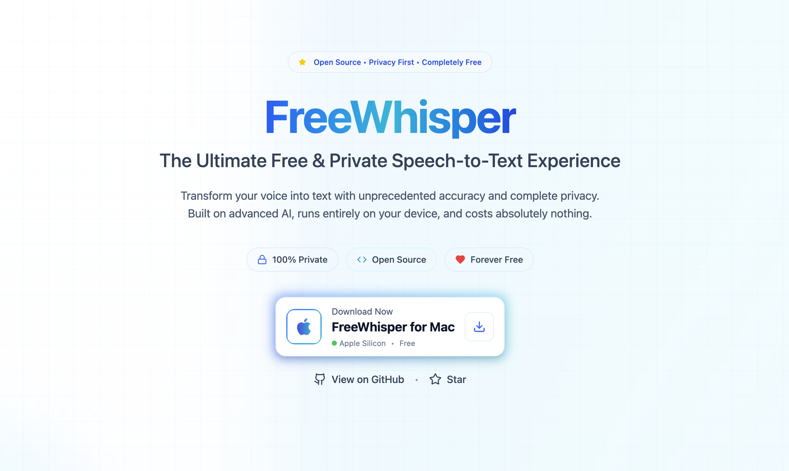
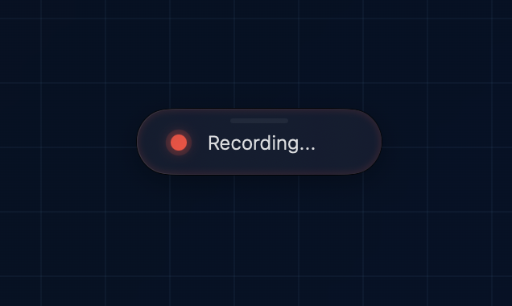

# FreeWhisper

FreeWhisper is a macOS application that provides real-time audio transcription using the Whisper model. It offers a seamless way to record and transcribe audio with customizable settings and keyboard shortcuts.

> **Note:** FreeWhisper is a fork of [OpenSuperWhisper](https://github.com/Starmel/OpenSuperWhisper). We've renamed and continued development of this excellent open-source project to provide a free alternative to paid transcription services.

<p align="center">
    
</p>
<p align="center"> 
</p>

Free alternative to paid services like:

- https://tryvoiceink.com
- https://goodsnooze.gumroad.com/l/macwhisper
- and etc..

## Features

- **Real-time transcription**: Convert speech to text using the Whisper AI model
- **Global shortcuts**: Quick access from anywhere on your Mac
- **Multiple model support**: Choose from different Whisper model sizes
- **Customizable settings**: Adjust language, model, and other preferences
- **Privacy-focused**: All processing happens locally on your device

## Installation

[github releases page](https://github.com/furkanksl/FreeWhisper/releases).

## Usage

1. Launch FreeWhisper
2. Grant necessary permissions (microphone and accessibility)
3. Use the global shortcut (default: Option + `) to start recording
4. Speak into your microphone
5. The transcription will appear in the app

## Configuration

- **Language**: Set your primary language for better transcription accuracy
- **Model**: Choose between different Whisper model sizes (faster vs. more accurate)
- **Shortcuts**: Customize global keyboard shortcuts
- **Output**: Configure how transcriptions are handled

## Requirements

- macOS 14.0 or later
- Microphone access permission
- Accessibility permission (for global shortcuts)

## Building from Source

```bash
git clone https://github.com/furkanksl/FreeWhisper.git
cd FreeWhisper
xcodebuild -scheme FreeWhisper -configuration Release
```

## License

FreeWhisper is licensed under the MIT License. See the [LICENSE](LICENSE) file for details.

## Contributing

Contributions are welcome! Please feel free to submit a Pull Request.

## Support

If you encounter any issues or have questions, please:

1. Check the existing issues in the repository
2. Create a new issue with detailed information about your problem
3. Include system information and logs when reporting bugs
